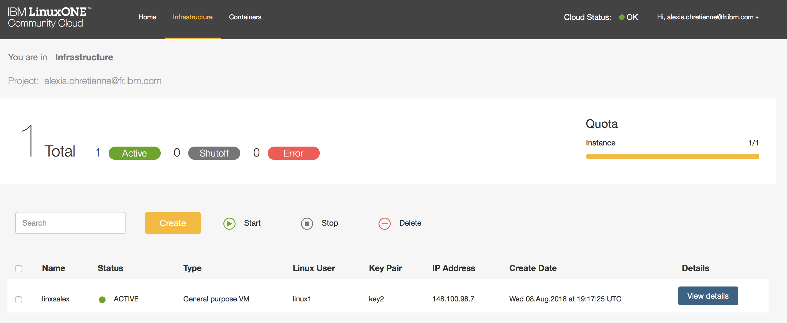

1. Create your LinuxONE virtual server to build the Docker image from the LinuxONE Community Cloud following the [virtual Server Deployment Guide](https://github.com/LinuxONE-community-cloud/technical-resources/blob/master/deploy-virtual-server.md): 

	1. You will request access to LinuxONE Community Cloud.
	2. You will make a first time setup (select XXXXXX)
	3. You will deploy your LinuxONE virtual server.
	4. You will log in to your LinuxONE virtual server using SSH.
	
	As a result, you have your LinuxONE virtual server (XXXXXX) created (**YOUR_LINUX_IP** is your LinuxONE virtual server IP Adress)
	
	
	
